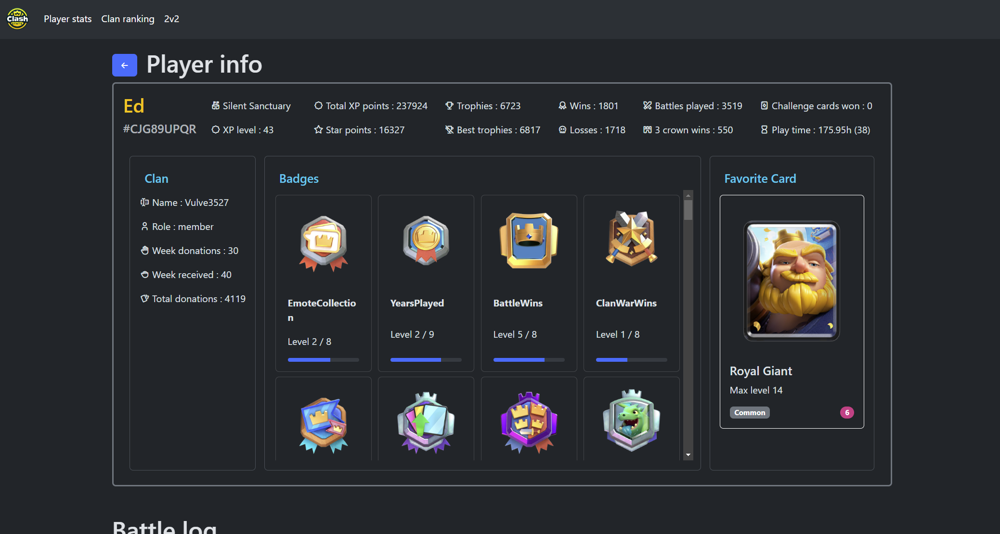
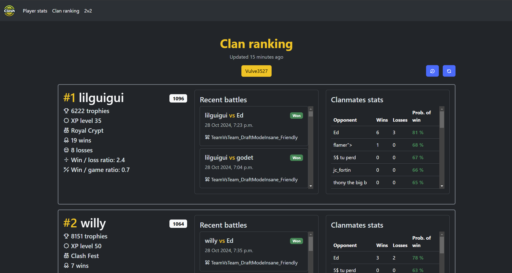
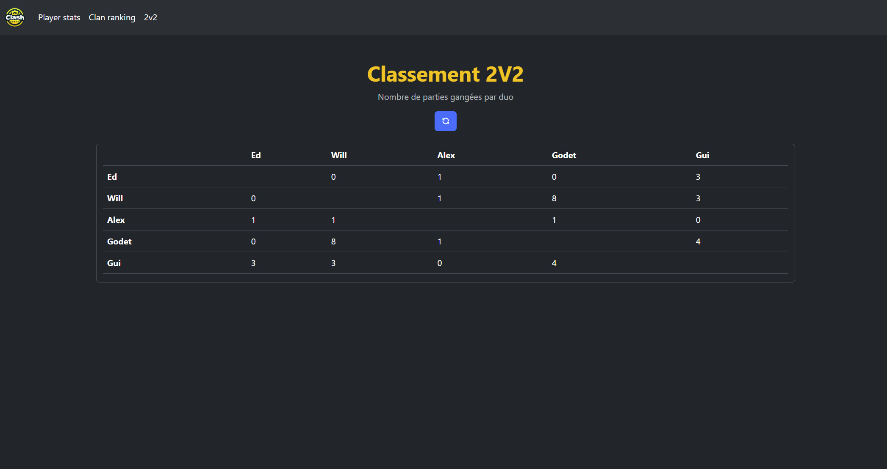

# Clashstats

A Django web app to get Clash Royale player info, battlelog and a clan ranking based on the ELO ranking system.

**Note that I am a beginner with Python and web development in general. This is one of my first projects, so this project may not follow all development guidlines and may contain bugs.**


### Player stats screenshot


### Clan ranking screenshot


### 2v2 ranking screenshot



## Run Locally

Clone the project

```bash
  git clone https://github.com/edbourque0/clashstats.git
```

Go to the clashstats directory

```bash
  cd clashstats
```

Create a .env file at the root of the project

```bash
  API_KEY=<your_api_key>
  DB_HOST=<database_host>
  DB_NAME=<database_name>
  DB_USER=<username>
  DB_PASS=<strong_password>
  DB_PORT=<database_port>
```

Install dependencies

```bash
  pip install -r requirements.txt
```

Go to the clashstats app

```bash
  cd clashstats
```

Start the server

```bash
  python3 manage.py runserver
```

## Environment Variables

| Variable Name | Description                       | Example  value       | Default value |
|---------------|-----------------------------------|----------------------|---------------|
| `DB_HOST`     | Database host address             | `localhost`          | `localhost`   |
| `DB_PORT`     | Database port number              | `5432`               | `5432`        |
| `DB_NAME`     | Name of the database              | `clashstats`         | `clashstats`  |
| `DB_USER`     | Database user                     | `username`           | `username`    |
| `DB_PASSWORD` | Password for the database user    | `P4Ssw0Rd`           | `password`    |
| `API_KEY`     | API key from [Clash Royale API](https://developer.clashroyale.com/#/)| `873yr4n27837rn28o7yh2y45rgfghfd3`   | `abc123` |


## Tech Stack

**Languages:** Python, HTML, CSS

**CSS components:** Bootstrap

**Framework:** Django

